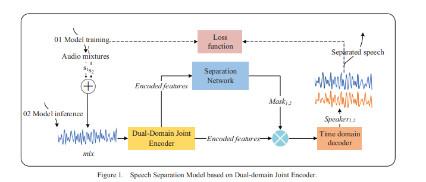
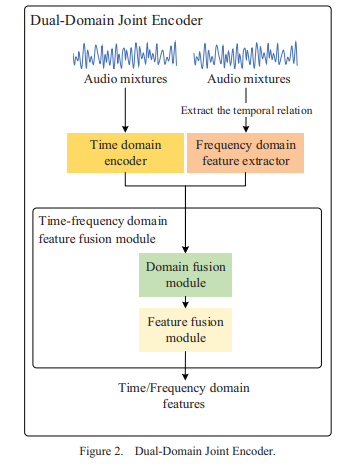

- [English Version](#reproduction-of-improved-speech-separation-via-dual-domain-joint-encoder-in-time-domain-networks)
- [中文版本](#复现通过时域网络中的双域联合编码器改进的语音分离)


# 复现《通过时域网络中的双域联合编码器改进的语音分离》

本仓库主要复现论文 **《Improved Speech Separation via Dual-Domain Joint Encoder in Time-Domain Networks》**（citeturn0file0）中的方法。我们的目标是严格按照论文中描述的方法和训练方案来重现实验结果，而非提出新的模型架构。

---

## 1. 概述

本文工作采用了一种双域（时域和频域）联合编码器的设计，用于语音分离。模型从原始混合语音中分别提取时域和频域特征，然后进行融合，接着通过预测掩码将混合语音分离为各个说话人的语音信号。训练时采用基于 SI-SNR（尺度不变信噪比）和 PIT（置换不变训练）损失的策略，有效解决了多说话人分离中的排列不确定性问题。



---


## 2. 模型架构

模型主要由以下几个模块组成：

### 2.1 时域编码器

- **目的：** 利用 Conv-TasNet 的思想，通过一维卷积从原始波形中提取局部时域特征。
- **操作：**
  - 对输入波形使用 kernel_size 为 16、步长为 8（无偏置）的 1D 卷积进行特征提取；
  - 经过 ReLU 激活后得到时域特征表示。
- **代码示例：**
  ```python
  self.time_encoder = nn.Conv1d(1, encoder_dim, kernel_size=16, stride=8, bias=False)
  ```
- **数学解析：**  
  对于输入信号 \( \mathbf{x} \in \mathbb{R}^{B \times 1 \times L} \)，卷积操作计算：
  \[
  y[t] = \max\Big(0, \sum_{i=0}^{15} w[i] \cdot x[t+i-P] \Big)
  \]
  其中 \(P\) 是填充量，用于保证输出对齐。

---

### 2.2 频域特征提取

- **目的：** 利用短时傅里叶变换（STFT）将时域信号转换为频域表示，再通过一维卷积提取局部频谱特征。
- **操作：**
  - 对输入信号计算 STFT 得到复数谱；
  - 取幅度谱并进行通道扩展后，利用 1D 卷积（kernel_size=3，padding=1）提取频域特征；
  - 激活函数采用 ReLU。
- **代码示例：**
  ```python
  self.freq_encoder = nn.Conv1d(n_fft // 2 + 1, encoder_dim, kernel_size=3, padding=1)
  ```
- **数学解析：**  
  经过 STFT 后，每个时间帧得到的幅度谱 \(|X|\) 经卷积后计算：
  \[
  \text{freq\_feat}[b, c, t] = \max\Big(0, \sum_{k=0}^{K-1} W_{\text{freq}}(c, k) \cdot |X|(b, k, t) + b_{\text{freq}}(c)\Big)
  \]
  其中 \(K = \frac{n_{\text{fft}}}{2}+1\)。

---

### 2.3 时频融合模块

- **目的：** 将时域和频域特征进行整合，形成一个融合的特征表示。
- **操作：**
  - 先使用插值方法将时域特征调整到与频域特征相同的时间步数；
  - 沿通道维度将时域特征与频域特征拼接；
  - 利用两层点卷积（kernel_size=1）和 ReLU 激活对拼接特征进行降维与重组。
- **代码示例：**
  ```python
  self.domain_fusion = nn.Sequential(
      nn.Conv1d(encoder_dim * 2, encoder_dim, kernel_size=1),
      nn.ReLU(),
      nn.Conv1d(encoder_dim, encoder_dim, kernel_size=1)
  )
  ```
- **数学解析：**  
  将时域特征 \(\mathbf{F}_{\text{time}} \in \mathbb{R}^{B \times encoder\_dim \times T}\) 和频域特征 \(\mathbf{F}_{\text{freq}} \in \mathbb{R}^{B \times encoder\_dim \times T}\) 拼接后：
  \[
  \mathbf{F}_{\text{concat}} \in \mathbb{R}^{B \times (2 \cdot encoder\_dim) \times T}
  \]
  随后通过连续两层点卷积和非线性激活进行映射，得到融合特征 \( \mathbf{F}_{\text{fused}} \in \mathbb{R}^{B \times encoder\_dim \times T} \)。

---

### 2.4 分离网络

- **目的：** 对融合特征进行进一步处理，提取更高阶的局部时序特征，为掩码预测提供优质的输入。
- **操作：**
  - 使用两层 1D 卷积（kernel_size=3, padding=1）以及 ReLU 激活；
- **代码示例：**
  ```python
  self.separation_net = nn.Sequential(
      nn.Conv1d(encoder_dim, encoder_dim, kernel_size=3, padding=1),
      nn.ReLU(),
      nn.Conv1d(encoder_dim, encoder_dim, kernel_size=3, padding=1),
      nn.ReLU()
  )
  ```
- **数学解析：**  
  每一层卷积在时间步 \( t \) 上的计算为：
  \[
  z(t) = \sum_{i=-1}^{1} W[i] \cdot f(t+i) + b,
  \]
  然后经过 ReLU 得到 \( \max(0, z(t)) \) 的非线性输出。

---

### 2.5 掩码预测

- **目的：** 为每个时间步生成用于分离语音的软掩码，每个掩码控制对应语音源的能量保留比例。
- **操作：**
  - 使用一个 1D 卷积（kernel_size=1）将输入特征映射到 2 个通道（对应两个说话人）；
  - 通常在前向传播中接着使用 sigmoid 将输出值限制在 [0,1]。
- **代码示例：**
  ```python
  self.mask_predictor = nn.Conv1d(encoder_dim, 2, kernel_size=1)
  ```
- **数学解析：**  
  对于每个时间步 \(t\)，将特征向量 \( \mathbf{f}(t) \in \mathbb{R}^{encoder\_dim} \) 线性映射为：
  \[
  \mathbf{m}(t) = \sigma\left(\mathbf{W} \, \mathbf{f}(t) + \mathbf{b}\right) \in \mathbb{R}^{2}
  \]
  其中 \(\sigma\) 为 sigmoid 函数。


---

## 3. 前向传播过程

前向传播将输入波形逐步经过各个模块，最终输出分离后的语音信号。

### 3.1 时域特征提取

```python
time_feat = F.relu(self.time_encoder(waveform))
```
- **输入：** 原始波形 \( \mathbf{x} \in \mathbb{R}^{B \times 1 \times L} \)
- **操作：** 经过时域编码器（1D 卷积 + ReLU）提取局部时域特征。
- **输出：** 时域特征 \( \text{time\_feat} \in \mathbb{R}^{B \times encoder\_dim \times T_{\text{time}}} \)

### 3.2 频域转换与特征提取

```python
spec = torch.stft(waveform.squeeze(1), n_fft=self.n_fft, hop_length=self.hop_length, return_complex=True)  
spec_mag = spec.abs().unsqueeze(1)  # 计算幅度谱
freq_feat = F.relu(self.freq_encoder(spec_mag.squeeze(1)))
```
- **操作：**
  - 利用 STFT 将波形转换为复数频谱 \( X(b, k, t) \)；
  - 取其幅度 \( |X| \) 并扩展通道后，输入频域编码器提取特征。
- **输出：** 频域特征 \( \text{freq\_feat} \in \mathbb{R}^{B \times encoder\_dim \times T} \)

### 3.3 时频特征融合

```python
time_feat = F.interpolate(time_feat, size=freq_feat.shape[2], mode="nearest")
combined_feat = torch.cat([time_feat, freq_feat], dim=1)
fused_feat = self.domain_fusion(combined_feat)
```
- **操作：**
  - 利用插值方法将时域特征调整为与频域特征相同的时间步数；
  - 在通道维度上拼接时域与频域特征；
  - 通过点卷积与 ReLU 进行融合，得到融合特征。
- **输出：** 融合特征 \( \text{fused\_feat} \in \mathbb{R}^{B \times encoder\_dim \times T} \)

### 3.4 预测掩码

```python
separated_feat = self.separation_net(fused_feat)
masks = torch.sigmoid(self.mask_predictor(separated_feat))
```
- **操作：**
  - 分离网络进一步提取局部时序特征；
  - 掩码预测模块将分离特征映射为 2 个通道，并通过 sigmoid 限制值域，生成两个说话人的软掩码。
- **输出：** 掩码 \( \text{masks} \in \mathbb{R}^{B \times 2 \times T} \)

### 3.5 频域掩码应用与 iSTFT 还原

```python
masked_spec = spec.unsqueeze(1) * masks.unsqueeze(2)
reconstructed = torch.istft(masked_spec.reshape(B * C, FR, T),
                             n_fft=self.n_fft, hop_length=self.hop_length, length=waveform.shape[-1])
separated_speech = reconstructed.reshape(B, C, -1)
```
- **操作：**
  - 将原始 STFT 结果扩展后，与预测掩码逐元素相乘，对每个说话人的频谱进行加权；
  - 重塑张量后，对每个说话人的掩码频谱执行逆 STFT，将其还原到时域；
  - 重塑输出张量，得到最终的分离语音。
- **输出：** 分离语音信号 \( \text{separated\_speech} \in \mathbb{R}^{B \times 2 \times L} \)

---

## 4. 损失函数

为训练模型，我们采用了 SI-SNR 损失和 PIT（置换不变训练）损失。

### 4.1 SI-SNR 损失

- **目的：** 测量估计语音与目标语音之间的相似度，同时对信号幅度缩放不敏感。
- **计算过程：**
  1. **投影：** 将估计信号在目标信号上投影：
     \[
     \text{target} = \frac{\langle \text{est\_source}, \text{target\_source} \rangle}{\|\text{target\_source}\|^2 + \epsilon} \times \text{target\_source}
     \]
  2. **误差信号：** 计算噪声分量：
     \[
     \text{noise} = \text{est\_source} - \text{target}
     \]
  3. **信噪比：** 计算能量比并转换为 dB：
     \[
     \text{SI-SNR} = 10 \log_{10}\left(\frac{\|\text{target}\|^2}{\|\text{noise}\|^2 + \epsilon}\right)
     \]
  4. **损失：** 取负均值作为损失，目标为最大化 SI-SNR。
- **实现函数：** `si_snr_loss`

### 4.2 PIT（置换不变训练）损失

- **目的：** 解决多说话人分离中因输出顺序不确定而产生的标签排列问题。
- **计算过程：**
  - 对于两个说话人，计算两种排列下的 SI-SNR 损失：
    - **排列 1：** 估计第一路对应目标第一路，估计第二路对应目标第二路。
    - **排列 2：** 估计第一路对应目标第二路，估计第二路对应目标第一路。
  - 最终选择损失最小的排列作为 PIT 损失：
    \[
    \text{PIT Loss} = \min(\text{loss}_1, \text{loss}_2)
    \]
- **实现函数：** `pit_loss`

---

## 5. 总结

本复现项目严格按照论文《Improved Speech Separation via Dual-Domain Joint Encoder in Time-Domain Networks》的方法进行实现。模型采用了时域与频域联合建模，通过时频特征融合、分离网络及掩码预测来实现高质量的语音分离。训练过程中，结合了 SI-SNR 和 PIT 损失，有效解决了多说话人分离中的排列问题，并最大化了语音重构质量。

本文档提供了模型架构、前向传播流程及损失函数的详细数学推导与代码说明，旨在帮助读者深入理解论文中各模块的设计思想及其在语音分离任务中的实际应用。

---

# Reproduction of "Improved Speech Separation via Dual-Domain Joint Encoder in Time-Domain Networks"

This repository contains a reproduction of the paper **"Improved Speech Separation via Dual-Domain Joint Encoder in Time-Domain Networks"** (citeturn0file0). The goal is to replicate the methods and results described in the paper. Note that the implementation follows the paper’s design and training protocol rather than proposing a new model.

---

## 1. Overview

In this work, a dual-domain (time and frequency) joint encoder is used for speech separation. The model extracts features from both the time and frequency domains, fuses them, and then estimates masks to separate mixed speech signals into individual sources. The training loss is computed using a combination of SI-SNR (Scale-Invariant Signal-to-Noise Ratio) and Permutation Invariant Training (PIT) losses, which handle the inherent permutation ambiguity in multi-speaker separation.

---

## 2. Model Architecture

The model is composed of the following key modules:

### 2.1 Time Domain Encoder

- **Purpose:** Extracts local time-domain features from the raw waveform using a 1D convolution.
- **Operation:** 
  - Applies a convolution with kernel size 16 and stride 8 (without bias) to learn a set of basis functions.
  - The output is activated by ReLU.
- **Code:**
  ```python
  self.time_encoder = nn.Conv1d(1, encoder_dim, kernel_size=16, stride=8, bias=False)
  ```
- **Mathematical Insight:**  
  For an input signal \( \mathbf{x} \in \mathbb{R}^{B \times 1 \times L} \), the convolution computes:
  \[
  y[t] = \max\left(0, \sum_{i=0}^{15} w[i] \cdot x[t+i-P] \right)
  \]
  where \(P\) is the padding ensuring appropriate alignment.

---

### 2.2 Frequency Domain Feature Extractor

- **Purpose:** Converts the time-domain signal into the frequency domain using STFT, then extracts features from the magnitude spectrum.
- **Operation:** 
  - Computes the Short-Time Fourier Transform (STFT) to obtain a complex spectrum.
  - Calculates the magnitude and applies a 1D convolution with kernel size 3 (padding 1) on the frequency bins.
  - Activation with ReLU is applied.
- **Code:**
  ```python
  self.freq_encoder = nn.Conv1d(n_fft // 2 + 1, encoder_dim, kernel_size=3, padding=1)
  ```
- **Mathematical Insight:**  
  After STFT, for each time frame, the magnitude spectrum \(|X|\) is processed as:
  \[
  \text{freq\_feat}[b, c, t] = \max\left(0, \sum_{k=0}^{K-1} W_{\text{freq}}(c, k) \cdot |X|(b, k, t) + b_{\text{freq}}(c)\right)
  \]
  where \(K = \frac{n_{\text{fft}}}{2}+1\).

---

### 2.3 Time-Frequency Fusion Module

- **Purpose:** Fuses the complementary time-domain and frequency-domain features.
- **Operation:**
  - First, the time-domain features are interpolated to match the time resolution of the frequency-domain features.
  - The features are concatenated along the channel dimension.
  - Two successive pointwise (kernel size 1) convolutions with ReLU activation perform the fusion.
- **Code:**
  ```python
  self.domain_fusion = nn.Sequential(
      nn.Conv1d(encoder_dim * 2, encoder_dim, kernel_size=1),
      nn.ReLU(),
      nn.Conv1d(encoder_dim, encoder_dim, kernel_size=1)
  )
  ```
- **Mathematical Insight:**  
  Given time features \(\mathbf{F}_{\text{time}}\) and frequency features \(\mathbf{F}_{\text{freq}}\) (both \(\in \mathbb{R}^{B \times encoder\_dim \times T}\)), concatenation yields:
  \[
  \mathbf{F}_{\text{concat}} \in \mathbb{R}^{B \times (2 \cdot encoder\_dim) \times T}.
  \]
  The subsequent pointwise convolutions act as learned linear mappings (with nonlinearity via ReLU) to compress and fuse the features.

---

### 2.4 Separation Network

- **Purpose:** Further refines the fused features to prepare them for mask estimation.
- **Operation:**  
  - Consists of two 1D convolutional layers (kernel size 3, padding 1) with ReLU activations.
- **Code:**
  ```python
  self.separation_net = nn.Sequential(
      nn.Conv1d(encoder_dim, encoder_dim, kernel_size=3, padding=1),
      nn.ReLU(),
      nn.Conv1d(encoder_dim, encoder_dim, kernel_size=3, padding=1),
      nn.ReLU()
  )
  ```
- **Mathematical Insight:**  
  Each convolution captures local temporal dependencies:
  \[
  z(t) = \sum_{i=-1}^{1} W[i] \cdot f(t+i) + b,
  \]
  followed by a ReLU to introduce nonlinearity.

---

### 2.5 Mask Estimation

- **Purpose:** Predicts soft masks for each speaker to separate the mixed signal.
- **Operation:**  
  - A 1D convolution with kernel size 1 maps the features to 2 channels (one per speaker).
  - A sigmoid activation is applied (typically during forward pass) to constrain the mask values to the [0,1] interval.
- **Code:**
  ```python
  self.mask_predictor = nn.Conv1d(encoder_dim, 2, kernel_size=1)
  ```
- **Mathematical Insight:**  
  For each time step \(t\), the linear transformation is:
  \[
  \mathbf{m}(t) = \sigma\left(\mathbf{W} \, \mathbf{f}(t) + \mathbf{b}\right) \in \mathbb{R}^2,
  \]
  where \(\sigma\) is the sigmoid function ensuring mask values between 0 and 1.

---

## 3. Forward Pass

The forward pass processes an input waveform through the entire model to output separated speech signals.

### 3.1 Time Domain Feature Extraction

```python
time_feat = F.relu(self.time_encoder(waveform))
```
- **Input:** Raw waveform \(\mathbf{x} \in \mathbb{R}^{B \times 1 \times L}\).
- **Operation:** Convolution + ReLU extracts local time-domain features.
- **Output:** \(\text{time\_feat} \in \mathbb{R}^{B \times encoder\_dim \times T_{\text{time}}}\).

### 3.2 Frequency Domain Transformation & Feature Extraction

```python
spec = torch.stft(waveform.squeeze(1), n_fft=self.n_fft, hop_length=self.hop_length, return_complex=True)  
spec_mag = spec.abs().unsqueeze(1)  # Compute magnitude
freq_feat = F.relu(self.freq_encoder(spec_mag.squeeze(1)))
```
- **Operation:** 
  - Compute STFT to obtain the complex spectrum \(X\).
  - Calculate the magnitude \(|X|\) and extract frequency features via convolution.
- **Output:** \(\text{freq\_feat} \in \mathbb{R}^{B \times encoder\_dim \times T}\).

### 3.3 Time-Frequency Feature Fusion

```python
time_feat = F.interpolate(time_feat, size=freq_feat.shape[2], mode="nearest")
combined_feat = torch.cat([time_feat, freq_feat], dim=1)
fused_feat = self.domain_fusion(combined_feat)
```
- **Operation:**
  - Interpolate time features to align time steps with frequency features.
  - Concatenate along the channel dimension.
  - Fuse via pointwise convolutions and ReLU.
- **Output:** \(\text{fused\_feat} \in \mathbb{R}^{B \times encoder\_dim \times T}\).

### 3.4 Mask Prediction

```python
separated_feat = self.separation_net(fused_feat)
masks = torch.sigmoid(self.mask_predictor(separated_feat))
```
- **Operation:**
  - Process fused features through the separation network.
  - Predict masks via a 1D convolution followed by sigmoid activation.
- **Output:** \(\text{masks} \in \mathbb{R}^{B \times 2 \times T}\).

### 3.5 Frequency Masking & iSTFT Reconstruction

```python
masked_spec = spec.unsqueeze(1) * masks.unsqueeze(2)
reconstructed = torch.istft(masked_spec.reshape(B * C, FR, T),
                             n_fft=self.n_fft, hop_length=self.hop_length, length=waveform.shape[-1])
separated_speech = reconstructed.reshape(B, C, -1)
```
- **Operation:**
  - Expand the dimensions of the original STFT spectrum and multiply by the predicted masks (applied per speaker).
  - Reshape and perform inverse STFT (iSTFT) to convert the masked spectra back to the time domain.
  - Reshape the output to obtain separated speech signals.
- **Output:** Separated speech signals \(\in \mathbb{R}^{B \times 2 \times L}\).

---

## 4. Loss Functions

The reproduction uses two key loss functions to optimize the network:

### 4.1 SI-SNR Loss

- **Purpose:** Measures the quality of the reconstructed speech relative to the target while being invariant to scaling.
- **Operation:**
  - Projects the estimated signal onto the target signal.
  - Computes the error (noise) and then the ratio of target energy to noise energy.
  - Converts the ratio to dB and averages the negative SI-SNR as the loss.
- **Mathematical Expression:**
  \[
  \text{SI-SNR} = 10 \log_{10} \left(\frac{\|\text{target}\|^2}{\|\text{noise}\|^2 + \epsilon}\right)
  \]
- **Implementation:** See function `si_snr_loss`.

### 4.2 PIT (Permutation Invariant Training) Loss

- **Purpose:** Addresses the label permutation problem inherent in multi-speaker separation.
- **Operation:**
  - Computes SI-SNR loss for all possible speaker assignments.
  - Selects the permutation that minimizes the loss.
- **Mathematical Expression:**
  \[
  \text{PIT Loss} = \min(\text{loss}_1, \text{loss}_2)
  \]
- **Implementation:** See function `pit_loss`.

---

## 5. Conclusion

This repository reproduces the speech separation model described in the paper **"Improved Speech Separation via Dual-Domain Joint Encoder in Time-Domain Networks"**. The model leverages both time and frequency domain representations, fuses them, and uses mask estimation for source separation. Loss functions based on SI-SNR and PIT are used to train the network robustly against the permutation problem.

The detailed explanations provided above cover the model architecture, forward pass, and loss functions—all grounded in both code and mathematical reasoning. This reproduction aims to closely follow the original paper’s design, ensuring that our results align with the reported findings.

---